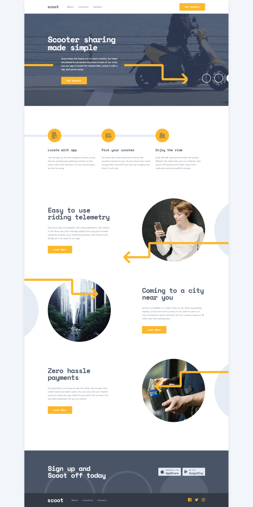

# Frontend Mentor - Scoot website solution

This is a solution to the [Scoot website challenge on Frontend Mentor](https://www.frontendmentor.io/challenges/scoot-multipage-website-N76alNPRJ). Frontend Mentor challenges help you improve your coding skills by building realistic projects.

## Table of contents

- [Overview](#overview)
  - [The challenge](#the-challenge)
  - [Screenshot](#screenshot)
  - [Links](#links)
- [My process](#my-process)
  - [Built with](#built-with)
  - [What I learned](#what-i-learned)
  - [Continued development](#continued-development)
- [Author](#author)

## Overview

### The challenge

Users should be able to:

- View the optimal layout for each page depending on their device's screen size
- See hover states for all interactive elements throughout the site

### Screenshot

### Links

- Solution URL: [Solution](https://github.com/socratesioa/scoot-multi-page-website)
- Live Site URL: [Live Site](https://scoot2312.netlify.app/)

## My process

### Built with

- Semantic HTML5 markup
- CSS custom properties
- Flexbox
- CSS Grid
- Mobile-first workflow
- [React](https://reactjs.org/) - JS library
- Vite
- Sass/SCSS

### What I learned

This was my first full project using React so needless to say I learned a ton. Using components, passing data, some JSX syntax. The basics of React. It was a great experience and I am very proud of it.

### Continued development

I just started learning and working with React so there's a lot to learn and play around with.

## Author

- Website - [My Portfolio](https://portfolio.thisissocrates.com/)
- Frontend Mentor - [@socratesioa](https://www.frontendmentor.io/profile/socratesioa)
